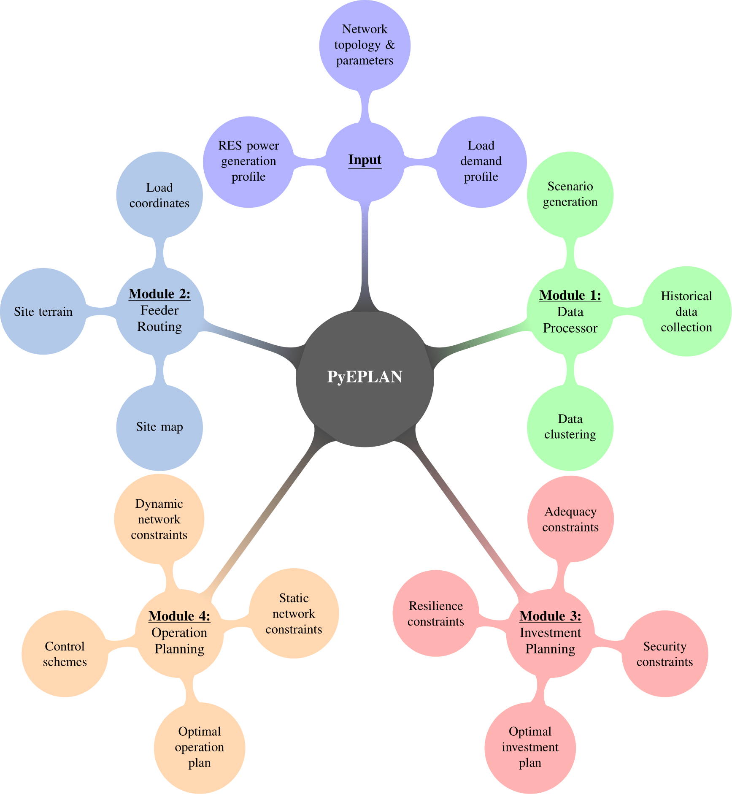

##########################################
 Introduction
##########################################

**PyEPLAN** is an open-source **Py**-thon-based **E**-nergy **Plan**-ning tool for design and operation of optimised microgrid networks.

   

Functionality
=============

The functions available in the PyEPLAN are packaged into for key modules that can be utilised independently or simultaneously:

**Data Processor**

The Data Processor module supports two main functionalities:

* It extracts historical data on wind speed and solar radiation based on the user provided cordinates of the generation source location from on openly available satelite information and creates 24-hour daily profiles for the given period of time.
* It finds representative days, based on daily profiles of load demands and power generations of renewable energy sources by applying machine learning algorithms such as K-means and Hierachical clustering. The representative days are used as operation scenarios providing the input data needed for the investment/operation planning modules.

**Feeder Routing**

The Feeder Routing module finds the least cost network design given the geographical distances between nodes, technical line parameters and cost of the different line types. It takes the user map coordinates of the node or load point locations and provides and optimal system layout using the minimum tree spanning algorithm.

**Investment Planning**

This module aims to minimise both investment costs during a long-term planning horizon (i.e., from one year to several years) under both investment and operation related techno-economic constraints.

Both the investment/operation planning module may require network characteristics (i.e., candidate/existing lines) as well as long-term/short-term estimated/forecasted load demands and power generations of RESs to obtain the optimal solution. The former can be user defined or obtained from the Feeder Routing module, and the latter can as well be user defined or obtained from the Data Processor module.

**Operation Planning**

This module aims to minimise operation costs during a short-term planning horizon (i.e., one day, hourly) under operation related techno-economic constraints. This module can be used independently or synchronously with the investment planning module.

What PyEPLAN uses under the hood
================================

It depends heavily on the following Python packages:

* `pandas <http://pandas.pydata.org/>`_ for storing data about components and time series
* `numpy <http://www.numpy.org/>`_ and `scipy <http://scipy.org/>`_ for 
* `pyomo <http://www.pyomo.org/>`_ for preparing optimisation problems
* `matplotlib <https://matplotlib.org/>`_ for 
* `networkx <https://networkx.github.io/>`_ 

Other comparable software
=========================

* ...
* ...

Target user group
=================

PyEPLAN is intended for researchers, planners ...

Licence
=======

PyEPLAN is released under the `Apache License 2.0 <https://www.apache.org/licenses/LICENSE-2.0>`_.
